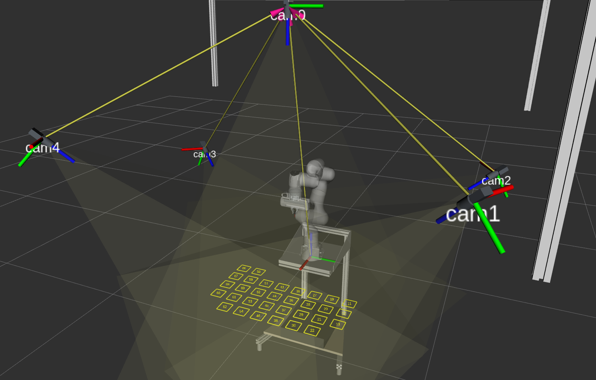
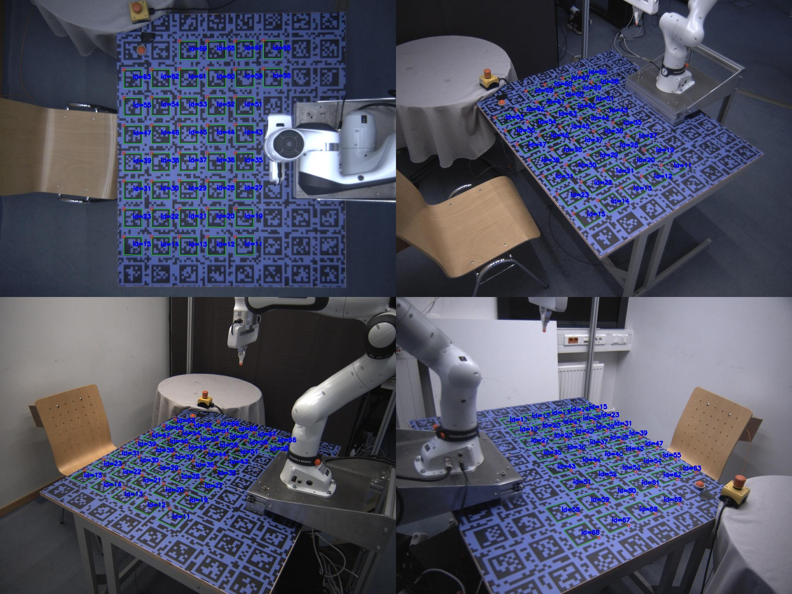
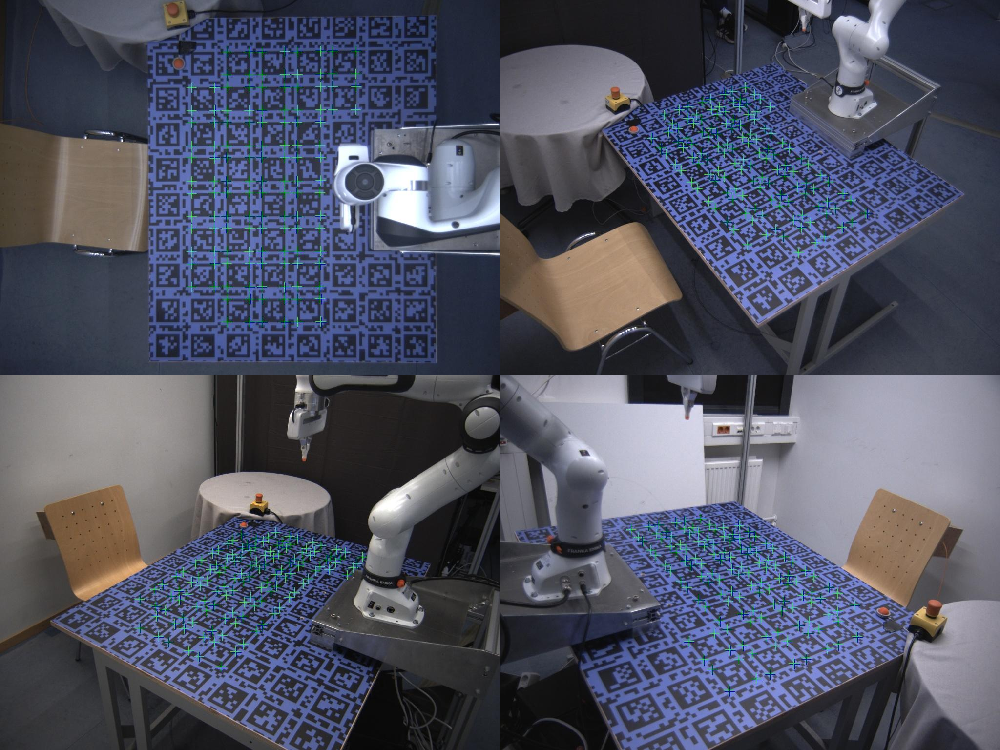

# 📦 flir_icp_calib

**ROS/ROS2 package to compute a homogeneous transformation from a multi-camera reference frame to a robot base frame, using an optical calibration target.**

Developed as part of my PhD research, this package is tailored for precise, repeatable calibration in vision-based robotic systems.

This module is part of my  **ROS/ROS2** [real-time 3D tracker](https://github.com/HenrikTrom/real-time-3D-tracking) and its [docker-implementation](https://github.com/HenrikTrom/ROSTrack-RT-3D).



📌 Overview

`flir_icp_calib` estimates a transformation between a synchronized multi-camera setup and a robot base, using ArUco marker detection, multi-view triangulation, and Iterative Closest Points (ICP). The final result is a static transform published via ROS for downstream tasks like perception or motion planning.

> *Highly recommended:* This tool is tightly integrated with my [Docker-based 3D tracking pipeline](https://github.com/HenrikTrom/Docker-Flir-Multi-Camera), which includes dependencies, camera setup, and calibration utilities out of the box.

### 📑 Citation

If you use this software, please use the GitHub **“Cite this repository”** button at the top(-right) of this page.

## Preriquisites

You will need:

* A set of synchronized FLIR cameras
* An optical calibration target with ArUco markers
* A robot capable of precise point placement (to collect ground-truth 3D points)

### Required Packages (if not using Docker setup)

If you're not using the [Docker pipeline](https://github.com/HenrikTrom/Docker-Flir-Multi-Camera), manually install these dependencies:

* [`cpp-utils`](https://github.com/HenrikTrom/cpp-utils)
* [`flirmulticamera`](https://github.com/HenrikTrom/FlirMultiCamera)
* [`keiko_msgs`](https://github.com/HenrikTrom/keiko-msgs)
* [`ros-node-interface`](https://github.com/HenrikTrom/ros-node-interface)

Moreover, you have to calibrate your cameras using a calibration target. I have written an auto-tool for the calibration. It is also part of my docker-pipeline. So go and [check it out](https://github.com/HenrikTrom/Docker-Flir-Multi-Camera)! :)

### Generate the calibration pattern files

#### Step 1
To generate the calibration pattern, use the scripts in `./pattern_generation`

```bash
python3 gen.py # Generates high resolution pattern files for printing
```
Print the file and fixate the pattern on the table.

Then take a photo of your printed file and make sure that the markers can get detected using
```bash
python3 detect.py # Checks how many markers are detected by OpenCV in your image
```

Note: If you customize the pattern (i.e. the dictionary) you have to adapt your Settings.json.

#### Step 2
Generate a 3D pointcloud in your robots base reference frame of the marker corners.

In our lab, I used a calibration tool attached to the robot and manually moved the tip to the aruco corners and recorded the positions using a python script.

The files structure should be identical to the ones stored in `./data`: **marker id as key and a 4x3 array with the 3D coordintates as value**

Refer to examples in the `./data` folder.


## Usage

### Launch the Calibration Interface

```bash
roslaunch flir_icp_calib interface.launch
```

This node:

* Detects markers
* Triangulates their 3D positions
* Matches them to ground truth using ICP
* Publishes a static transform

> 🔁 Use the following services to control the interface remotely (e.g., for auto-recalibration):

```bash
/flir_ros_interface/transform_publisher/start
/flir_ros_interface/transform_publisher/stop
/flir_ros_interface/transform_publisher/shutdown
```

> ⚠️ You can't use the cameras for streaming and calibration simultaneously. Theoretically the images could get streamed via ROS. However, this adds a LOT of overhead to the system and makes real-time tracking more challenging.


You can configure the node using this json file `./cfg/TransformsSettings.json`
```json
{
    "online": true, # Use the cameras or pre-saved images
    "log": false, # Log each result in the ./log folder
    "load_path_offline": "", # Path to images taken to generate transform from (offline)
    "camera_settings_file": "", # Path to flir-camera settings .json
    "aruco_dictionary": 20, # Dict identifer as integer 
    "h": 10, # Number of markers along h
    "w": 8, # Number of markers along w
    "min_markers": 10, # Minimum markers to be detected by the minimum amount of cameras
    "calibration_file": "", Path to camera calibration .json (extrinsic and intrinsic parameters)
    "min_cameras_per_point": 3, # Minimum amount of cameras needed per triangulation 
    "local_pattern_file": "", # Path to local 3D pattern .json
    "max_reprojection_error_images": 2, # Maximum reprojection error for triangulation 
    "max_reprojection_error_robot": 5, Maximum reprojection error for local 3D pattern
    "parent_frame_id": "cam0", # Parent frame id for ROS transform
    "child_frame_id": "fr3_link0", # Child frame id for ROS transform
}
```


### Publish Precomputed Transform

```bash
rosrun flir_icp_calib publish_result <path-to-your-results-folder>
```

Useful when camera access is unavailable but transform broadcasting is needed.

#### Interface Workflow Summary

The transform interface computes its results by the following steps:

1. Takes an image with each camera or uses the local ones provided by `load_path_offline` in `./cfg/TransformsSettings.json`
2. Detect ArUco markers
3. Triangulates and validates the camera extrinsics/intrinsics calibration with a first reprojection check
4. Loads the 3D pattern and computes the intersection between the local and triangulated cornersfor
5. Matches triangulation and local 3D patterns using _Iterative Closest Points_
6. Saves the transform and reprojection results to `./test/data`
7. Publishes static transforms
8. Publishes the following topics:
```bash
/flir_ros_interface/transform_publisher/det_aruco_markers # visualization_msgs/MarkerArray for debugging
/flir_ros_interface/transform_publisher/aruco_corrdinates_cam0 # keiko_msgs/ArucoMarkers3d for Aruco marker 3D coorninates in the main cameras reference frame
```

## Mathematical Background

#### Multi-View Triangulation

To triangulate image point in 3D space, we model each image point as ray vector using the cameras intrinsic and extrinsic parameters. We then have to find the point that is closest to all the rays.
The problem is explained in more detail [here](https://amytabb.com/tips/tutorials/2021/10/31/triangulation-DLT-2-3/).

#### Iterative Closest Points ICP

The final homogeneous transform matrix consists of a rotation matrix and a translation vector. ICP computes the rotation matrix using single value decomposition and computes the translation vector with the result. The entire technique is [here](https://igl.ethz.ch/projects/ARAP/svd_rot.pdf) in full detail. 

### Detected markers and Reprojected 3D pattern




## Acknowledgments

* Special thanks to **Cheng Minghao**, whose code for triangulation and camera calibration was modified for this package.
